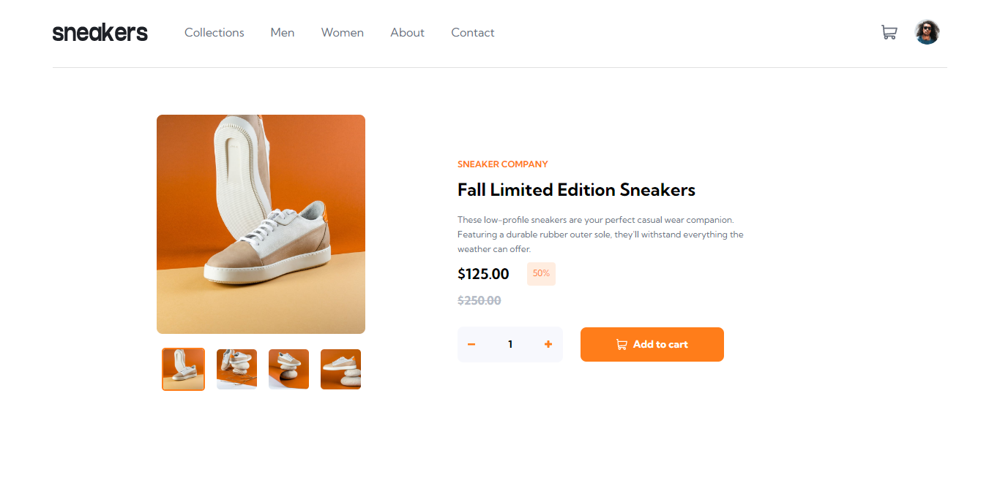
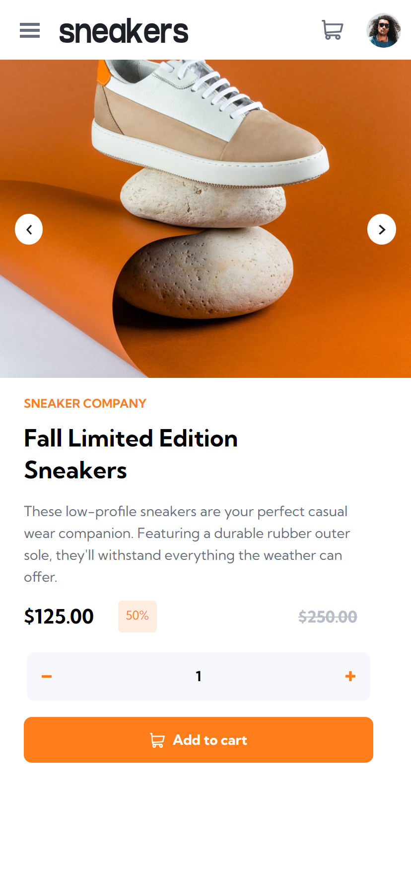

# Frontend Mentor - E-commerce product page solution

This is a solution to the [E-commerce product page challenge on Frontend Mentor](https://www.frontendmentor.io/challenges/ecommerce-product-page-UPsZ9MJp6). Frontend Mentor challenges help you improve your coding skills by building realistic projects.

## Table of contents

- [Overview](#overview)
  - [The challenge](#the-challenge)
  - [Screenshot](#screenshot)
  - [Links](#links)
- [My process](#my-process)
  - [Built with](#built-with)
  - [What I learned](#what-i-learned)
  - [Continued development](#continued-development)
  - [Useful resources](#useful-resources)
- [Author](#author)

## Overview

The ecommerce product page is designed to showcase a particular object in great detail, with the option to view it from multiple angles using a carousel. When you click on the product, a large view carousel appears, allowing you to see the product in bigger view.

To purchase the product, simply click the "Add to Cart" button after specifyiing the quantity you want. Your selected item will be added to your shopping cart, which can be viewed by clicking the cart icon in the navigation bar.

The page provides an immersive and user-friendly shopping experience, allowing you to fully explore and appreciate the product before making your purchase. The website is designed to be responsive across multiple devices using React library, MUI.

### The challenge

Users should be able to:

- View the optimal layout for the site depending on their device's screen size
- See hover states for all interactive elements on the page
- Open a lightbox gallery by clicking on the large product image
- Switch the large product image by clicking on the small thumbnail images
- Add items to the cart
- View the cart and remove items from it

### Screenshot




### Links

- Solution URL: [Add solution URL here](https://github.com/noah-mydn/Ecommerce-Product-Page)
- Live Site URL: [Add live site URL here](https://ecommerce-product-noah.netlify.app)

## My process

### Built with

- Semantic HTML5 markup
- CSS custom properties
- [Material UI](https://mui.org) - React MUI 
- [React](https://reactjs.org/) - JS library


### What I learned

During the development of my project, I gained knowledge on constructing MUI Carousels utilizing the third-party library called [react-material-ui-carousel](https://learus.github.io/react-material-ui-carousel/). This particular library facilitated an effortless implementation of the carousel feature with flexible customization options, which resulted in a reduction of code required for the feature's implementation

```

const IMAGES = ['./assets/image-product-1.jpg','./assets/image-product-2.jpg',
'./assets/image-product-3.jpg','./assets/image-product-4.jpg'];


<Carousel NextIcon={}
                    PrevIcon={}
                    indicators={false}
                    animation='slide'
                    duration={1000}
                    navButtonsAlwaysVisible={true}
                    navButtonsProps={{
                      style:{
                        margin:'0.5em',
                        background:'white',
                        padding:'0.35em',
                      }
                    }}
                    >
                        {IMAGES.map((image)=> {
                          return (
                            <Box component='img' src={image} key={image}/>
                          )
                          
                        })}
          </Carousel>
```


### Continued development

In terms of future development, It would be beneficial to add user authentication for secure purchasing, implement a checkout function with Stripe for easy payment processing, and expand the product range to offer more options for customers.

### Useful resources

- [react-material-ui-carousel](https://learus.github.io/react-material-ui-carousel/) - This helps me implement the carousel for mobile view.


## Author

- Website - [Add your name here](https://mayyadanar.netlify.app)
- Frontend Mentor - [@yourusername](https://www.frontendmentor.io/profile/noah-mydn)
- Twitter - [@yourusername](https://www.twitter.com/noah_ydn)

